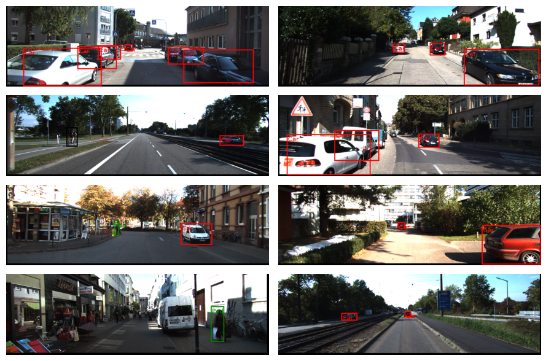

# 2D Object Detection

## Project Environment

This repository is tested on Ubuntu 22 with an Nvidia RTX 4090 GPU. To use this repository, please follow these steps:

- Make sure [anaconda](https://www.anaconda.com/docs/getting-started/anaconda/install) is installed.
- Clone this repository or download as a zip.
- Make sure your system has Anaconda installed. Open a terminal to the root directory and enter the following command:
`conda env create -f environment.yml`
This will create a conda environment with the required libraries.
- After the required libraries have been installed, type `conda activate object_detection_2d` in your terminal to activate the newly created environment.

## Dataset

The dataset used for this project is the [KITTI 2D Object Detection Evaluation](https://www.cvlibs.net/datasets/kitti/eval_object.php?obj_benchmark=2d). The parts of this dataset used are:
1. RGB Images (12 GB)
2. Training Labels (5 MB)

Enter `bash download_dataset.sh` in your terminal to automatically download and organize the dataset. The dataset will require about 12 GB of free space and, depending on the internet speed, may take a while to download.

### Details of the Dataset

#### Images

The RGB images depict a variety of scenes containing different objects. There are 7481 images in the training set and 7518 in the validation/test set.

#### Labels

The labels exist only for the training set. These `.txt` files contain the following:

1. The object class.
2. Truncation - A measure of how much the object out of image bounds. 0 $\rightarrow$ non-truncated. 1 $\rightarrow$ truncated.
3. Occlusion. 0 $\rightarrow$ not occluded. 1 $\rightarrow$ partly occluded. 2 $\rightarrow$ mostly occluded. 3 $\rightarrow$ unknown.
4. Observation angle $[-\pi,\pi]$.
5. 2D bounding box of objects in the image. Contains coordinates of 4 corners.
6. 3D object dimensions in meters.

    i. Height
    
    ii. Width
    
    iii. length
7. 3D center location in camera coordinates.
8. Rotation angle around the y-axis $[-\pi,\pi]$.

For the 2D object detection task, we only need the object class and the bounding box coordinates.

## Model and Data Processing

### Model

The model used for object detection in this work is the RetinaNet first used by [Lin et al.](https://arxiv.org/abs/1708.02002) This work uses a variant of the [Official PyTorch Implementation of RetinaNet](https://github.com/yhenon/pytorch-retinanet/tree/master). However, some functions had to be changed to fit the custom data-loader used in this work. Some of the changes are:

- The layer that outputs the final score, labels and anchor indices of the predicted boxes has been changed from doing 1 operation to all the images in the batch to individual operation per image in the batch. This is done to allow computation of metrics, such as the mean average precision.
- The pyramid level 7 is removed since the generated anchors are too tall for the images in the KITTI dataset. The [pyramid feature network](./src/models/retinanet/retinanet_layers.py/) is updated accordingly.

### Data Split

As mentioned earlier, the labels exist only for the training set. The training set is split in a $8:2$ ratio to get a validation set with labels.

### Image Dimensions

The image dimensions are not consistent across the dataset. Reshaping images would require transforming the bounding box coordinates to meet the new object coordinates. Instead of reshaping, the images are padded to the same height and width. The original annotations can still be used.

## Results

Detections on the validation set after training on 3 classes (cars, pedestrians and cyclists) are shown below. Depending on the threshold used for [NMS](src/models/retinanet/outputs.py), there may be spurious boxes on a single objects, or missing boxes on objects in close proximity to detected objects.

  

